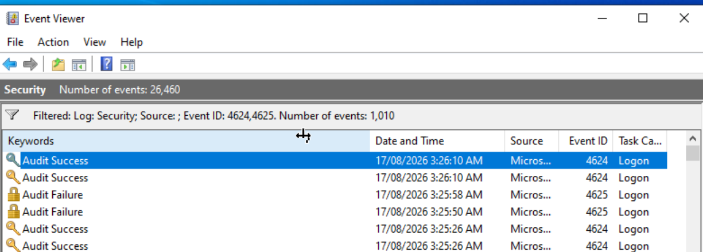
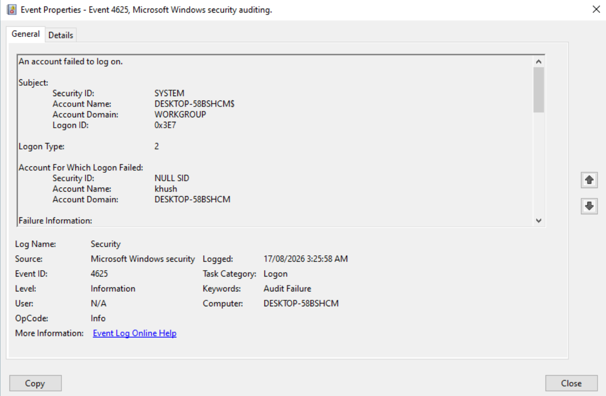
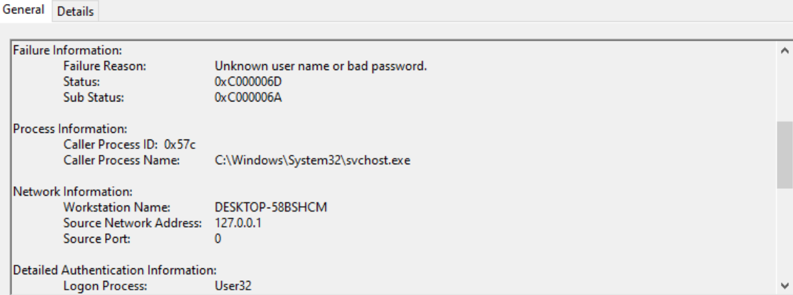
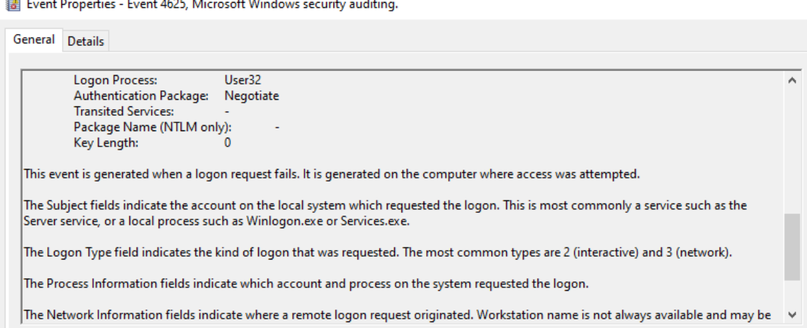
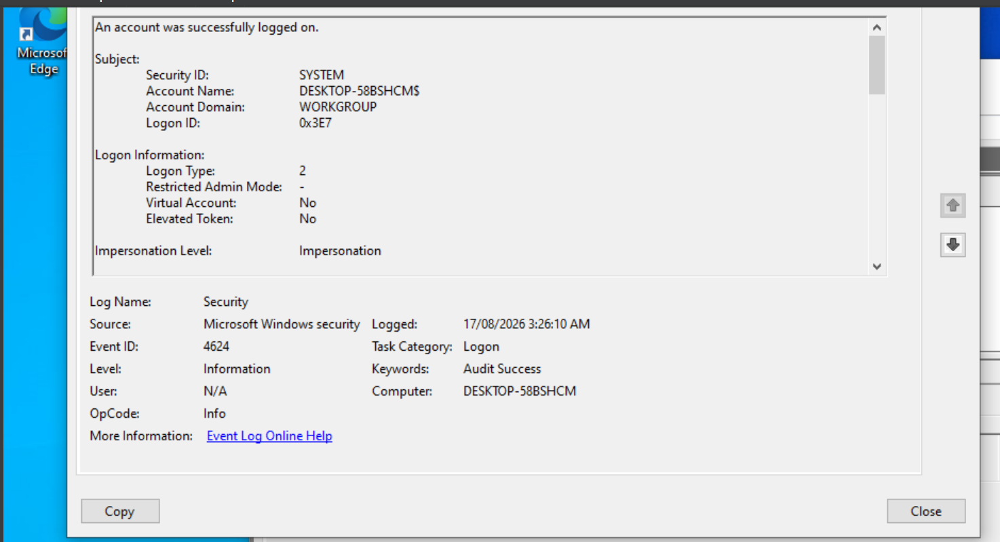

\# Investigation 001 - Windows Failed Logon Followed by Successful Logon

\*\*Date:\*\* 17 August 2026

\*\*Case Type:\*\* Identity / Authentication

\*\*Environment:\*\* Home SOC Lab - Windows 10 VM (Win10-Target2)

\*\*Data Source:\*\* Windows Security Event Log

\*\*Tools:\*\* Windows Event Viewer

\---

\## Scenario

As part of my SOC home lab, I generated two failed Windows logon attempts followed by a successful logon. I investigated the Windows Security logs to determine what happened and whether the authentication activity should be classified as benign, suspicious, or malicious.

This investigation was performed directly in Windows Event Viewer before connecting the VM to Microsoft Sentinel.

&#x20;

\## Investigation Question

Do the failed authentication events indicate normal user error or potentially suspicious authentication activity?

\## Evidence

### Authentication Event Timeline

The Windows Security log was filtered for Event IDs 4624 and 4625 to correlate failed and successful authentication activity.

\### Event 1 -  Failed Logon

* Event ID: 4625
* Time: 03:25:05 AM
* Account: khush
* Host: DESKTOP-58BSHCM
* Logon Type: 2 (Interactive)
* Status: 0xC000006D
* Sub Status: 0xC000006A
* Source Network Address: 127.0.0.1
* Caller Process: svchost.exe
* Logon Process: User32
* Authentication Package: Negotiate

#### Failed Logon Evidence

The event shows a failed authentication for account `khush` using Logon Type 2 (Interactive).

The failure details show Status `0xC000006D`, Sub Status `0xC000006A`, and Source Network Address `127.0.0.1`.

\### Event 2 - Failed Logon

* Event ID: 4625
* Time: 03:25:58 AM
* Account: khush
* Same host and Logon Type 2
* Same failure pattern as the first event

\### Event 3 - Successful Logon

* Event ID: 4624
* Time: 03:26:10 AM
* Account: khush
* host: DESKTOP-58BSHCM
* Logon Type: 2 (Interactive)
* Elevated Token: No
* Virtual Account: No

#### Successful Logon Evidence

The subsequent Event 4624 records a successful Logon Type 2 authentication on the same Windows host.

\### Timeline

| Time -- | Event | Result ----- |

| ------- | ----- | ------------ |

| 03:25:50| 4625  | Failed Logon |

| 03:25:50| 4625  | Failed Logon |

| 03:26:50| 4624  | Successful logon |

\---

\## Analysis

Windows Event ID 4625 records a failed logon attempts, while Event ID 4624 records a successful logon.

Both failed attempts involved the same account and host. The Sub Status '0xC000006A' indicates that an incorrect password was supplied for the account.

The events used Logon Type 2, indicating interactive logon activity. The failed events also showed the loopback address `127.0.0.1`.

Together, these fields are consistent with local interactive authentication and provide no evidence in these events of a remote network-originated authentication attempt.

The two failures were followed 12 seconds later by a successful Logon Type 2 authentication using the same account.

\---

\## Classification

\*\*Likely Benign\*\*

\---

\## Reasoning

The observed pattern is consistent with a user entering an incorrect password twice and then successfully entering the correct password.

Factors supporting this assessment include:

* only two failed attempts;
* the same account and host across the events;
* Logon Type 2 interactive authentication;
* incorrect-password Sub Status;
* loopback source address on the failed events; and
* successful authentication shortly after the failures.

Based on the available telemetry, I found insufficient evidence to classify the activity as malicious or suspicious.

\---

\## MITRE ATT\&CK Mapping

\*\*Not mapped.\*\*

I would not map this activity to T1110 (Brute Force) based only on these events. Two failed local interactive logons followed by a successful logon do not provide sufficient evidence of systematic credentials guessing.

\---

\## Recommended Action

\*\*Close as likely benign - no containment required based on the available evidence.\*\*

If this occurred in a production environment, I would document the investigation and follow the organisation's escalation procedures if additional suspicious indicators were identified.

\---

\## What Would Make This Suspicious?

I would investigation further or consider escalation if I observed:

* a large number of failed authentication attempts;
* failures involving multiple accounts;
* a remote or unexpected source;
* unusual logon types;
* authentication involving a privileged account;
* repeated failures over an extended period;
* the user reporting that they did not attempt the login; or
* suspicious activity occurring after the successful authentication.

\---

\## Limitations

Post-logon process correlation was not completed because Event Viewer became unresponsive while reviewing the lab VM.

The investigation therefore does not claim that post-authentication activity was verified.

\---

\## Lessons Learned

This investigation helped me understand:

* the difference between Windows Event IDs 4625 and 4624;
* why Logon Type matters during authentication triage;
* how Status and Sub Status provide more detail than the event description alone;
* why authentication events should be correlated rather than investigated individually;
* the importance of distinguishing evidence from assumptions; and
* why benign activity should not be unnecessarily mapped to MITRE ATT\&CK techniques.

For future lab testing, I will use a dedicated synthetic test account rather than my normal lab user account.

