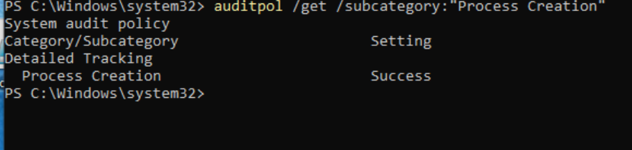
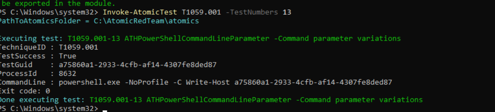
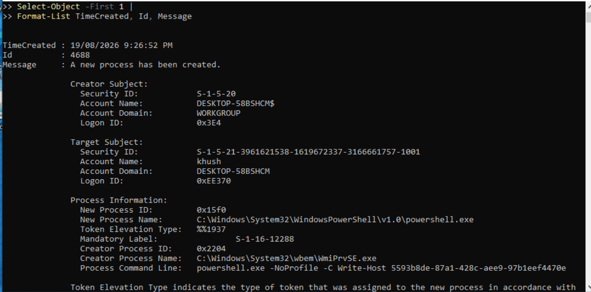
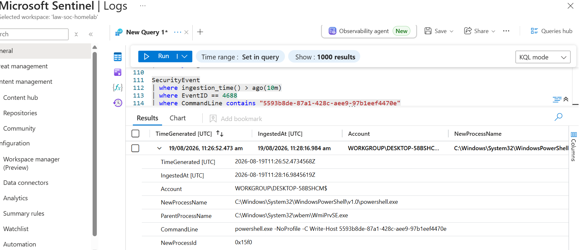
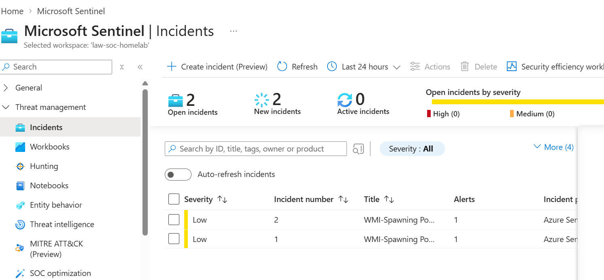
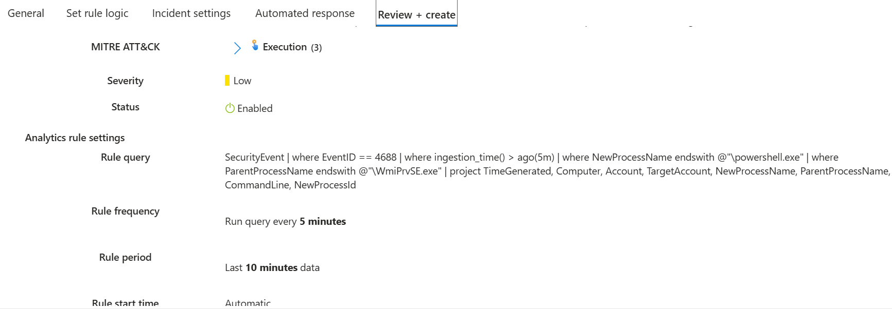
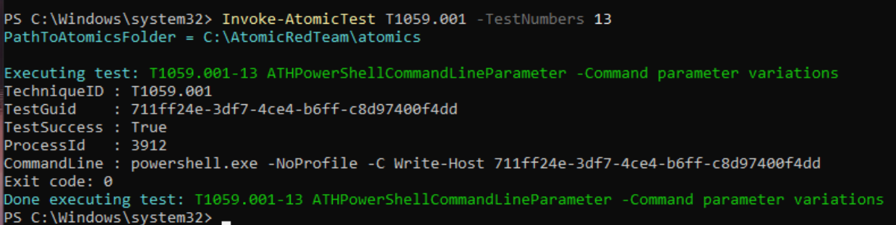
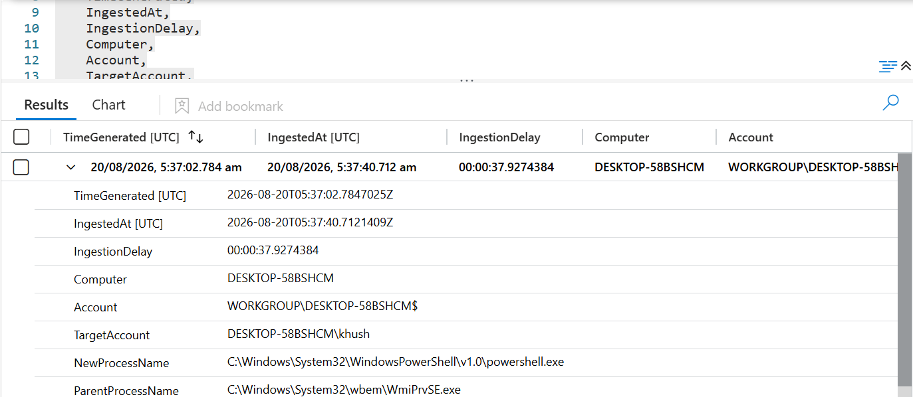
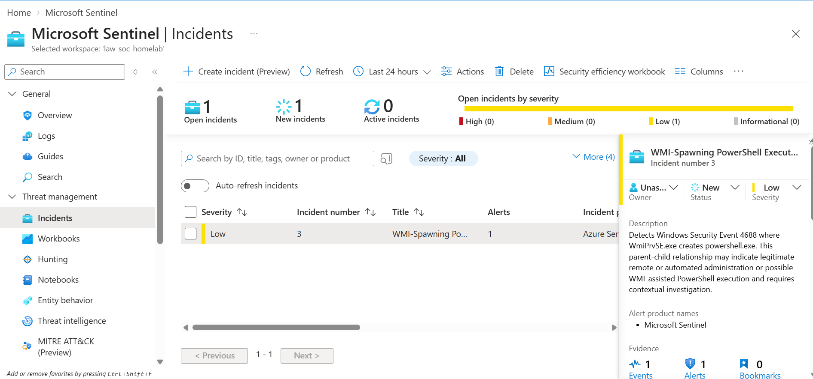

# Investigation 002 - WMI-Spawned Powershell Execution

## Overview 
In this investigation, I used Atomic Red Team to generate a controlled Powershell process on my Windows 10 lab VM. The test caused WMI to launch Powershell, producing Windows Security Event ID 4688.
I searched for the event in Microsoft Sentinel, created a scheduled analytics rule to detect the behaviour, and investigated the incidents generated by the rule.
The activity was authorised lab testing, so I closed the incidents as Benign Positive. During testing, I also discovered that the original rule created two incidents for one event. I investigated the duplication, tuned the rule and confirmed the fix with a second test.

## Lab Environment
- Windows 10 VirtualBox VM: `DESKTOP-58BSHCM`
- Azure Arc and Azure Monitor Agent
- Log Analytics workspace: `law-soc-homelab`
- Microsoft Sentinel
- Atomic Red Team test: `T1059.001-13`
- Windows Security Event ID: `4688`

## Step 1 - Verify Process Creation Auditing
Before  running the test, I checked whether Windows was configured to record successful process-creation events.
I used: 
```powershell
auditpol /get /subcategory:"Process Creation"
```
The result showed that successful Process Creation auditing was enabled. This was important because the investigation depended on Windows generating Event ID 4688.



## Step 2 - Run the Controlled Test
I ran Atomic Red Team test `T1059.001-13`. This is a controlled Powershell command-line test that prints a unique GUID with `Write-Host`.
The GUID gave me a reliable value to search for in Windows and Sentinel.



## Step 3 - Examine the local Windows Event
I searched the local Windows Security log for the test GUID and found Event ID 4688

The event showed:
- New process: `powershell.exe`
- Parent process: `WmiPrvSE.exe`
- Target account: `DESKTOP-58BSHCM\khush`
- Command line: `powershell.exe -NoProfile -C Write-Host <GUID>`
- Token Elevation Type: `%%1937`

Windows describe `%%1937` as Type 1, meaning a full token with no privileges removed or groups disabled. This field described the token assigned to the process, but it did not prove malicious privilege escalation.



## Step 4 - Correlate the Event in Sentinel
I searched the `SecurityEvent` table using the unique test GUID:
```kql
SecurityEvent
| where TimeGenerated > ago(30m)
| where EventID == 4688
| where CommandLine contains "<GUID>"
| extend IngestedAt = ingestion_time()
| extend IngestionDelay = IngestedAt - TimeGenerated
| project TimeGenerated, IngestedAt, IngestionDelay, Computer,
          Account, TargetAccount, NewProcessName,
          ParentProcessName, CommandLine, NewProcessId
```
The matching Sentinel record confirmed the same GUID, process ancestry, account context and command line. I also calculated the delay between event generatiion and ingestion.



## Field Analysis
The `Account` field showed the computer account because the process was created through the WMI service context. The `TargetAccount` field identified my lab user account.
`WmiPrvSE.exe` as a parent process is neither malicious nor benign by itself. WMI is used by legitimate administration and monitoring tools, but attackers can also misuse it to launch processes. The command line, identity, source and follow-on activity must therefore be examined before making a decsion.

## Step 5 - Create the Analytics Rule
I created a low-severity scheduled analytics rule:
```kql
SecurityEvent
| where EventID == 4688
| where NewProcessName endswith @"\powershell.exe"
| where ParentProcessName endswith @"\WmiPrvSE.exe"
| project TimeGenerated, Computer, Account, TargetAccount,
          NewProcessName, ParentProcessName,
          CommandLine, NewProcessId
```

The rule was configured with:
- Severity: Low
- Run frequency: 5 minutes
- Lookback period: 10 minutes
- Alert threshold: More than 0 results
- Event grouping: One alert for each event
- Incident creation: Enabled
- Host entity: Computer
- Account entity: TargetAccount

I selected Low severity because this parent-child process relationship can occur during legitimate administration. The rule identifies behaviour that requires investigation; it does not by itself prove malicious activity.

## Duplicate-Incident Finding
The first test generated Incidents 1 and 2, because both incidents contained the same GUID, account, host, command line and event timestamp.


I determined that the duplication was caused by the rule schedule:
- The rule ran every five minutes.
- Each rule examined the previous ten minutes.
- The same event remained inside two consecutive query windows.

This taught me that a detection rule must be tested for duplication alerting, not only checked to see whether it fires.

## Rule Tuning
I kept the ten-minute lookback to tolerate ingestion delays, but added an ingestion-time condition:
```kql
SecurityEvent
| where EventID == 4688
| where ingestion_time() > ago(5m)
| where NewProcessName endswith @"\powershell.exe"
| where ParentProcessName endswith @"\WmiPrvSE.exe"
| project TimeGenerated, Computer, Account, TargetAccount,
          NewProcessName, ParentProcessName,
          CommandLine, NewProcessId
```
The scheduled rule continued to examine the last ten minutes of data, but the `ingestion_time()` condition restricted each execution to records ingested during the most recent five minutes.


## Validation
I ran one fresh Atomic test after saving the tuned rule.


The event arrived in Sentinel with an ingestion delay of approximately 38 seconds.


After refreshing the incident list, only Incident 3 appeared.


Validation result: one Atomic execution - one SecurityEvent - one alert - one incident.

## MITRE ATT&CK Mapping

- **T1059.001 - PowerShell:** directly supported because PowerShell executed with a command-line parameter.
- **T1047 - Windows Management Instrumentation:** relevant to the general behaviour detected bythe rule because `WmiPrvSE.exe` created PowerShell.
For this particular event, WMI was used by the Atomic test harness to create the process. Therefore, the event does not prove that an attacker deliberately used T1047. ATT&CK mapping describes observable behaviour; it does not prove that each detection is malicious.

## Assessment and Disposition

**Classification:** Benign Positive
**Containment:** Not required

The rule correctly detected its intended behaviour, so this was not a false positive. However, the activity was authorised Atomic Red Team testing and the command only printed a GUID. I found no encoded command, download activity, security-control tampering, credential access, persistence or unexpected network activity.

## Lessons Learned
- A suspicious-looking parent process is an investigation lead, not a verdict.
- A true detection can still represent benign activity.
- `TimeGenerated` and `ingestion_time()` answer different questions.
- Unique GUIDs provide stronger event correlation than approximate timestamps.
- Detection validation should check for both missed events and duplicate alerts.
- ATT&CK mapping describes behaviour and does not prove malicious intent.

