# Case 002A: Microsoft Sentinel SOAR Triage and Containment Simulation

## Overview

This case extends Case 002, where I detected a PowerShell process spawned by WMI on my Windows lab VM. I built and tested Microsoft Sentinel automation around that detection.

The project has an automatic triage path and a separate manual containment-simulation path:

- `AR-Case002-WMI-Triage` runs when the analytics rule creates an incident. It adds the `Lab-Automation-Triage` tag and starts `PB-Case002-WMI-Triage`.
- `PB-Case002-WMI-Triage` adds a structured triage comment. It checks the live incident before acting and skips incidents that are closed or already contain the triage marker.
- `PB-Case002-WMI-Containment-Sim` is started manually by the analyst. It adds a simulation comment and the `Containment-Simulated` tag. It does not isolate a host or change the incident status, severity, or owner. If run again, it detects its marker and stops without changing anything.

I deliberately kept containment manual. In this lab, manually starting the second playbook is the human approval step.

## Lab components

- **Data source:** Windows Security Event Log collected through Azure Arc and Azure Monitor Agent
- **SIEM:** Microsoft Sentinel in Log Analytics workspace `law-soc-homelab`
- **Analytics rule:** `WMI-Spawning PowerShell Execution`
- **Automation rule:** `AR-Case002-WMI-Triage`
- **Automatic playbook:** `PB-Case002-WMI-Triage`
- **Manual containment-simulation playbook:** `PB-Case002-WMI-Containment-Sim`
- **Identity model:** System-assigned managed identity with the Microsoft Sentinel Responder role scoped to `rg-soc-homelab`

## Detection logic

The analytics rule identifies Windows process-creation events where `WmiPrvSE.exe` starts `powershell.exe`. This parent-child relationship was the behaviour investigated in Case 002. It can represent legitimate administration or suspicious WMI-assisted execution, so each alert requires investigation context.

```kql
SecurityEvent
| where EventID == 4688
| where ingestion_time() > ago(5m)
| where NewProcessName endswith @"\powershell.exe"
| where ParentProcessName endswith @"\WmiPrvSE.exe"
| extend CommandLine = iif(isempty(CommandLine), "Not available", CommandLine)
| project
    TimeGenerated,
    Computer,
    Account,
    TargetAccount,
    NewProcessName,
    ParentProcessName,
    CommandLine,
    NewProcessId
```

The rule is named `WMI-Spawning PowerShell Execution`. It runs every five minutes, looks back over the previous ten minutes, and creates one alert per matching event.

The ten-minute lookback period overlaps with the next rule run. Without an additional control, the same event can be evaluated more than once and create duplicate alerts or incidents. `ingestion_time() > ago(5m)` limits the rule to events that arrived during the most recent five minutes. I added this after observing duplicate incidents in Case 002.

The `extend` line replaces an empty Event 4688 command line with `Not available`. This means the `ProcessCommandLine` custom detail remains readable even when command-line auditing did not provide a value.

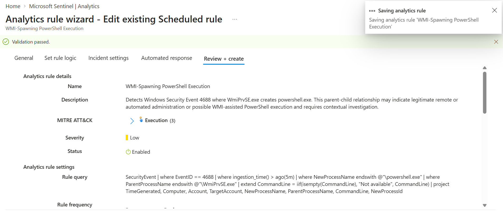

## Alert custom details

I added the following fields to the analytics rule so important process evidence appears directly in the Sentinel alert and incident:

- `ProcessCommandLine` → `CommandLine`
- `ParentProcess` → `ParentProcessName`
- `NewProcess` → `NewProcessName`

Incident 5 confirmed that all three custom details were populated, including the Atomic Red Team GUID in `ProcessCommandLine`.

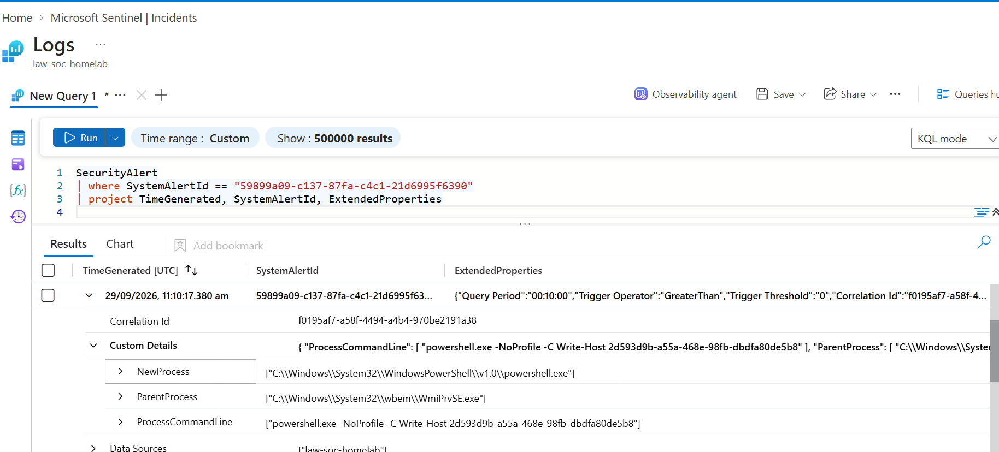

## Automatic triage workflow

The automation rule starts the triage playbook only for incidents created by the WMI-spawned PowerShell analytics rule.

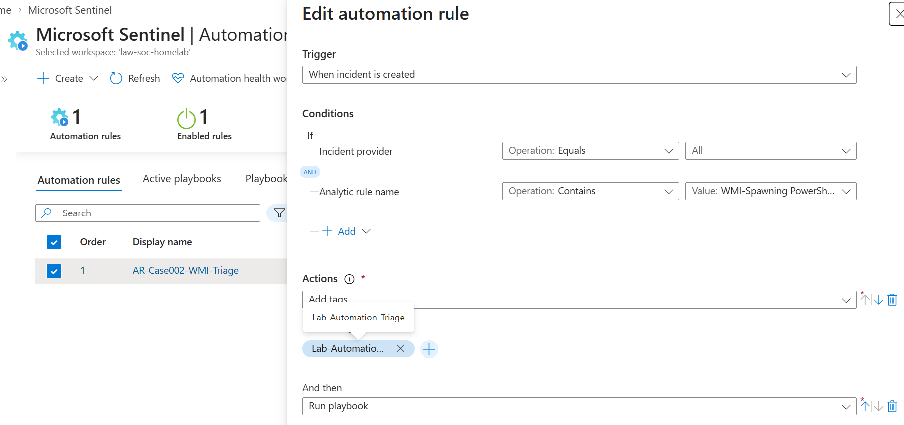

The playbook uses its managed identity to retrieve the incident from Sentinel. It checks the live incident rather than relying only on the trigger data, because the incident could have changed between creation and playbook execution.

The playbook then applies these safeguards:

1. **Closed incident check:** if the incident is already closed, the playbook ends with status `Cancelled` and does not add a new comment.
2. **Duplicate marker check:** if the incident already contains `[AUTO-TRIAGE:WMI-v1]`, the playbook ends with status `Cancelled` and does not add a second triage comment.
3. **Open, untriaged incident:** the playbook adds a structured comment containing the marker and triage context.

A `Cancelled` run is an expected skip, not a failed playbook run.

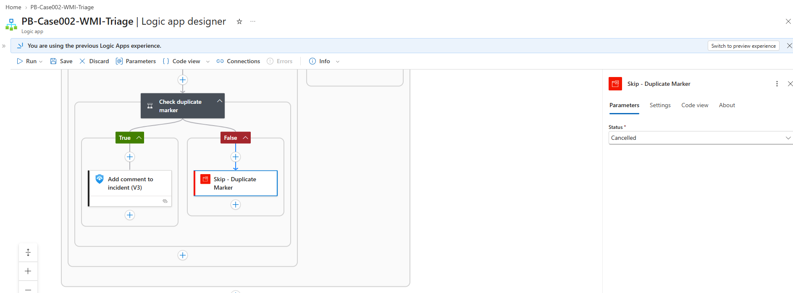

## Manual containment simulation

`PB-Case002-WMI-Containment-Sim` is not connected to an automation rule. The analyst starts it manually from the Sentinel incident page after reviewing the available evidence.

The playbook retrieves the selected incident, then checks for the marker `[CONTAINMENT-SIM:WMI-v1]`.

- If the marker is absent, the playbook adds a containment-simulation comment and the `Containment-Simulated` tag.
- If the marker is already present, the playbook ends with status `Cancelled`.

This playbook is deliberately documentation-only. It does not isolate a device, disable an account, change incident status, change severity, or assign an owner.

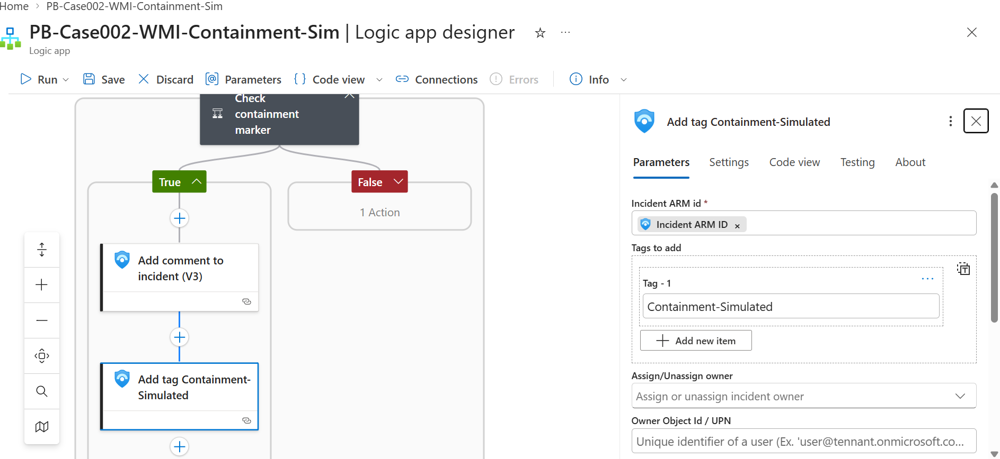

I confirmed the logic in Code view rather than relying on the designer summary. The condition uses `not contains`, and the tag action contains only the incident ID and the tag.

The containment playbook uses a system-assigned managed identity with the Microsoft Sentinel Responder role on `rg-soc-homelab`. This follows least privilege: the playbook can read incidents and add comments or tags without broad Contributor permissions.

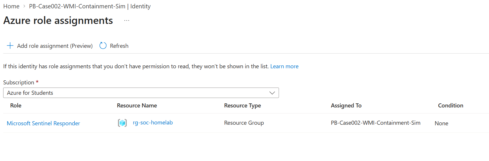

## Testing and results

I tested the safeguards rather than assuming they worked.

- **Open incident test:** the triage playbook added the triage comment to an open incident.
- **Closed incident test:** I closed Incident 3, then resubmitted an earlier triage run against it. The trigger data still showed the status as `New`, but the live check returned `Closed`, so the run ended `Cancelled` without adding a comment. This showed why the live check matters.

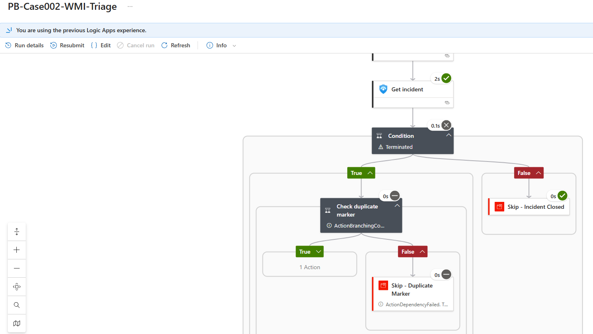

- **Duplicate triage test:** I ran the triage playbook against an incident that already contained `[AUTO-TRIAGE:WMI-v1]`. The duplicate branch executed, the comment action was skipped, and the comment count did not change.

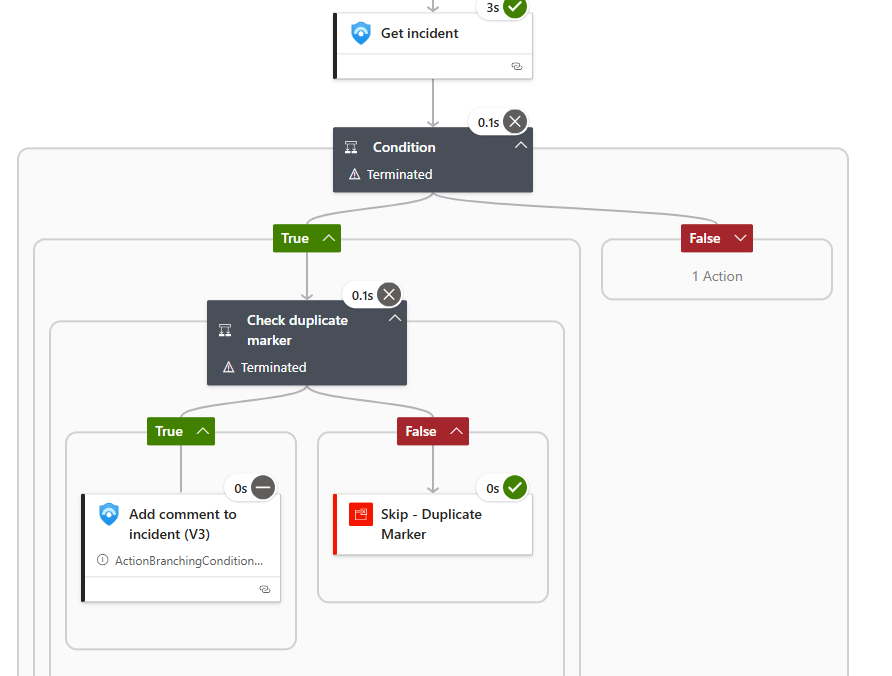

- **Regression test:** Incident 5 was created by the analytics rule, tagged by the automation rule, and received one triage comment from the playbook.

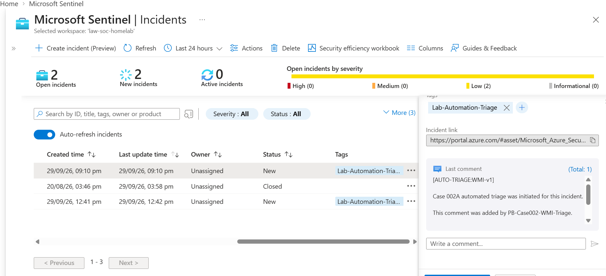

- **Custom-detail test:** the alert for Incident 5 contained `ProcessCommandLine`, `ParentProcess`, and `NewProcess`. `ProcessCommandLine` included the Atomic Red Team GUID `2d593d9b-a55a-468e-98fb-dbdfa80de5b8`.
- **Containment baseline:** before testing, Incident 5 had one comment, one tag, and status New, severity Low, owner Unassigned.

- **Containment first-run test:** the manual containment playbook added one simulation comment and the `Containment-Simulated` tag. Status, severity, and owner were unchanged.

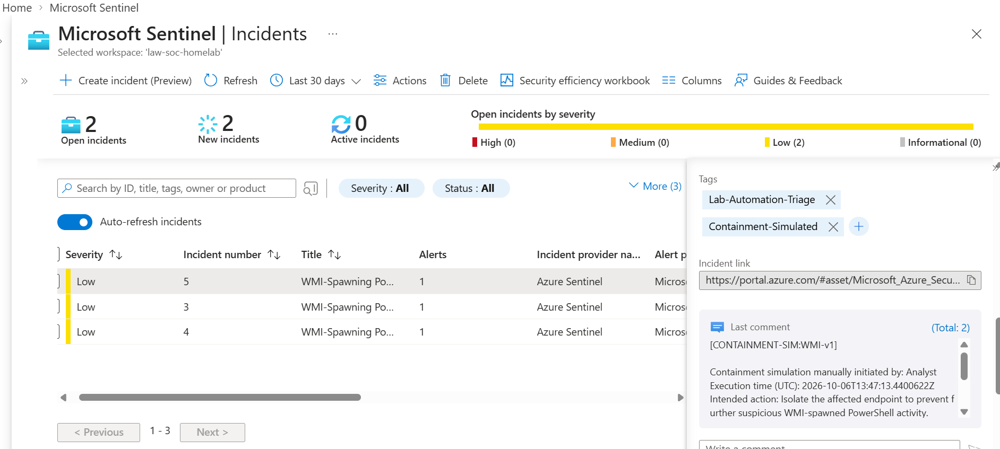

- **Containment duplicate test:** a second run detected `[CONTAINMENT-SIM:WMI-v1]`, followed the false branch, and ended `Cancelled`. The incident's last update time stayed at 11:47 pm after the 11:51 pm run, which shows the duplicate run changed nothing. The Sentinel incident panel displayed `Unknown`; because Logic Apps showed the expected cancelled duplicate branch, I treated this as a Sentinel display limitation rather than a failed safeguard.

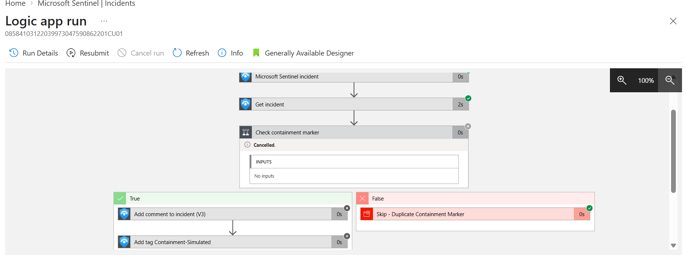

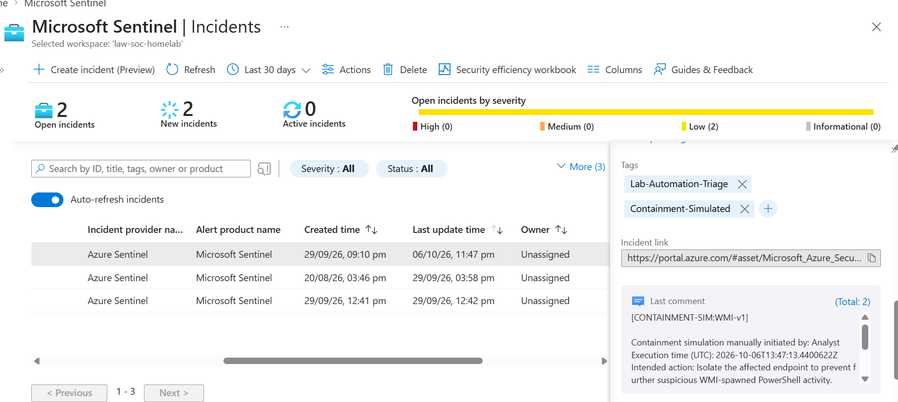

## Failure visibility

I created an Azure Monitor alert, `AM-PB-Case002-WMI-Triage-Failed`, to monitor failed runs of the automatic triage playbook.

I performed one controlled failure test by using an invalid incident identifier. The playbook run failed and the Azure Monitor alert triggered, then resolved after the failure condition cleared.

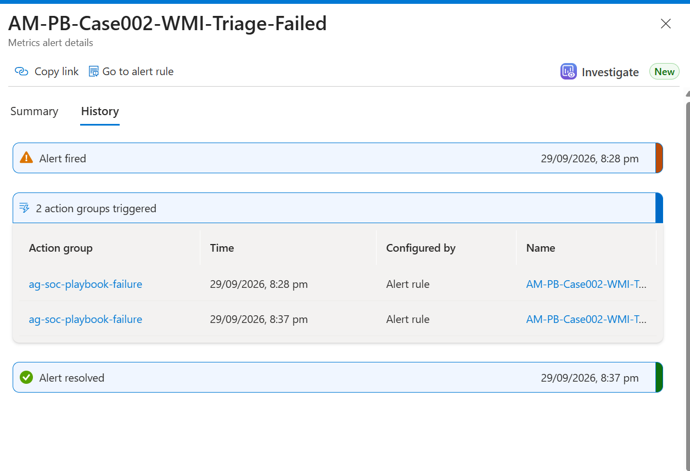

The alerting path was proven. Actual email receipt from the action group was not confirmed. An action-group Test operation returned HTTP 409, "Free subscription not supported"; this proves a limitation of the test operation, not the cause of missing live email delivery.

## Limitations and planned improvements

- The containment-simulation playbook does not yet have its own failed-runs alert. A separate alert should monitor `PB-Case002-WMI-Containment-Sim`.
- The containment-simulation playbook does not yet have an outer closed-status check. The analyst currently provides that safeguard by choosing an appropriate incident before manually running it.
- Review and testing are the current safeguards ensuring the containment playbook only adds a comment and tag. Future work could add validation for permitted incident-field changes.
- The detection rule relies on event ingestion. Following a prolonged VM shutdown, I observed that Arc and Heartbeat telemetry could be healthy while `SecurityEvent` ingestion was delayed. Heartbeats alone do not prove that the security data required for a detection is arriving.
- The analytics rule uses ingestion time to reduce duplicate processing. This helps with overlap, but rule scheduling and ingestion timing still require monitoring and testing.

## Skills demonstrated

- Writing and tuning a Microsoft Sentinel scheduled analytics rule
- KQL filtering, projection, and data-quality handling
- Alert custom details for investigation context
- Sentinel automation rules and Logic Apps playbooks
- System-assigned managed identity and least-privilege role assignment
- Idempotent automation using markers
- Human approval before containment-related actions
- Positive, negative, duplicate, and controlled-failure testing
- Distinguishing evidence, known limitations, and planned improvements

## Conclusion

This project automated repeatable documentation and enrichment for a controlled WMI-spawned PowerShell detection while preserving analyst decision-making. The containment action was simulated rather than performed on a host. The testing showed that the workflow comments once, skips closed or already-processed incidents, and records manual containment simulation without changing incident ownership, severity, or status.